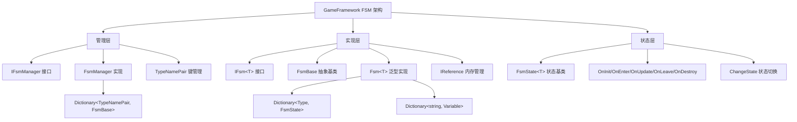
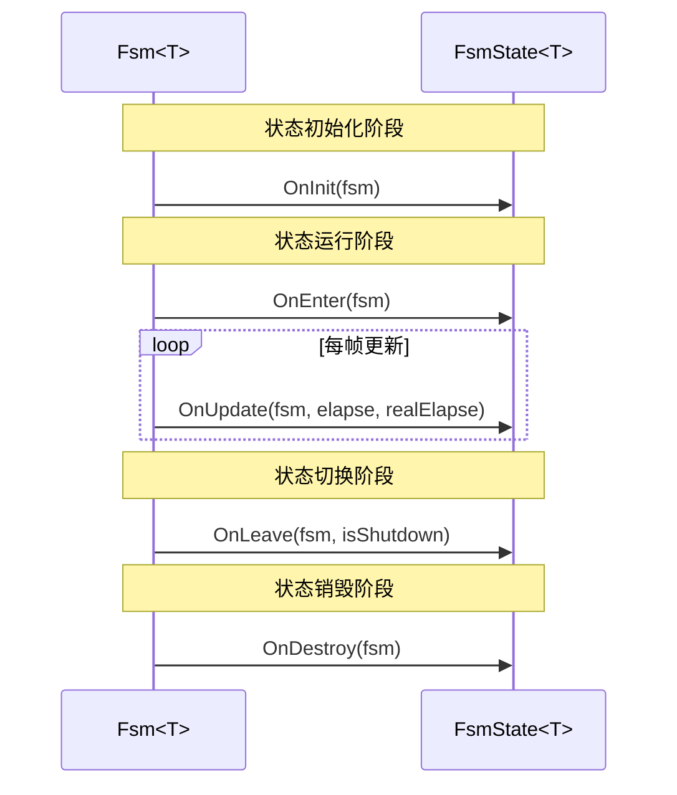
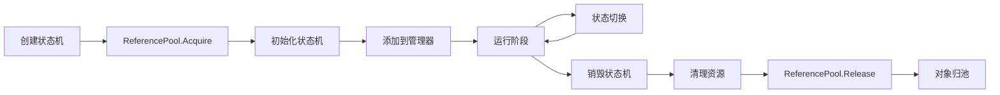
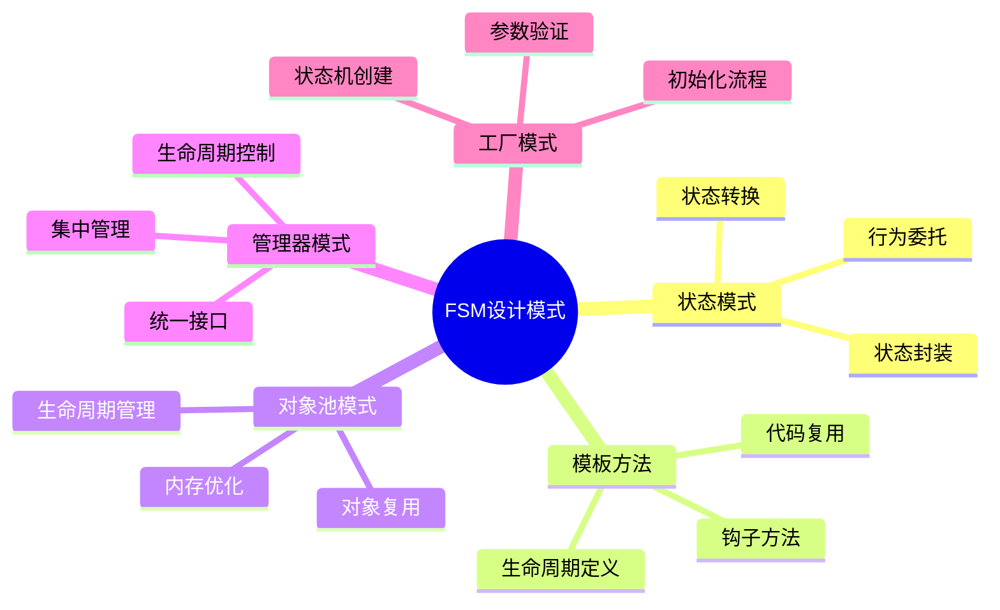

# GameFramework FSM模块实现方式深度分析

## 1. 模块架构概览

GameFramework的FSM模块采用分层架构设计，通过接口抽象、泛型实现和引用池优化，构建了一个高性能、类型安全的状态机系统。



## 2. 核心设计模式分析

### 2.1 状态模式 (State Pattern)

FSM模块是状态模式的典型实现，将状态相关的行为封装在独立的状态类中。

**实现方式：**
```csharp
// 抽象状态基类定义状态接口
public abstract class FsmState<T> where T : class
{
    protected internal virtual void OnEnter(IFsm<T> fsm) { }
    protected internal virtual void OnUpdate(IFsm<T> fsm, float elapseSeconds, float realElapseSeconds) { }
    protected internal virtual void OnLeave(IFsm<T> fsm, bool isShutdown) { }
}

// 状态机持有当前状态引用
private FsmState<T> m_CurrentState;

// 状态切换逻辑
internal void ChangeState(Type stateType)
{
    m_CurrentState.OnLeave(this, false);  // 离开当前状态
    m_CurrentState = GetState(stateType); // 切换状态
    m_CurrentState.OnEnter(this);         // 进入新状态
}
```

**优势分析：**
- **开闭原则**：新增状态无需修改现有代码
- **单一职责**：每个状态类只负责自己的行为逻辑
- **消除条件分支**：避免大量if-else或switch-case

### 2.2 模板方法模式 (Template Method Pattern)

状态基类定义了状态生命周期的模板方法，具体状态类实现细节。

**生命周期模板：**


### 2.3 对象池模式 (Object Pool Pattern)

通过IReference接口实现对象池管理，减少GC压力。

**实现细节：**
```csharp
// 状态机实现IReference接口
internal sealed class Fsm<T> : FsmBase, IReference, IFsm<T>

// 创建时从池中获取
Fsm<T> fsm = ReferencePool.Acquire<Fsm<T>>();

// 销毁时归还池中
internal override void Shutdown()
{
    ReferencePool.Release(this);
}

// 清理方法重置对象状态
public void Clear()
{
    // 清理状态、数据、引用等
    m_Owner = null;
    m_States.Clear();
    m_CurrentState = null;
    m_IsDestroyed = true;
}
```

### 2.4 管理器模式 (Manager Pattern)

FsmManager作为中央管理器，统一管理所有状态机实例。

**核心结构：**
```csharp
// 使用复合键管理状态机
private readonly Dictionary<TypeNamePair, FsmBase> m_Fsms;

// TypeNamePair结构体设计
internal struct TypeNamePair : IEquatable<TypeNamePair>
{
    private readonly Type m_Type;
    private readonly string m_Name;
    
    public TypeNamePair(Type type, string name)
    {
        m_Type = type ?? throw new ArgumentNullException(nameof(type));
        m_Name = name ?? string.Empty;
    }
}
```

## 3. 关键实现技术分析

### 3.1 泛型约束设计

**Owner类型约束：**
```csharp
public interface IFsm<T> where T : class
public abstract class FsmState<T> where T : class
```

**优势：**
- 确保Owner必须是引用类型
- 提供编译时类型安全
- 避免装箱拆箱开销

**状态类型约束：**
```csharp
public void Start<TState>() where TState : FsmState<T>
public bool HasState<TState>() where TState : FsmState<T>
```

### 3.2 状态存储策略

**基于Type的字典存储：**
```csharp
private readonly Dictionary<Type, FsmState<T>> m_States;

// 状态注册
Type stateType = state.GetType();
if (m_States.ContainsKey(stateType))
{
    throw new GameFrameworkException("状态已存在");
}
m_States.Add(stateType, state);
```

**优势分析：**
- O(1)查找性能
- 自然的类型到实例映射
- 避免字符串键的拼写错误

### 3.3 数据管理系统

**Variable系统集成：**
```csharp
private Dictionary<string, Variable> m_Datas;

public void SetData<TData>(string name, TData data) where TData : Variable
{
    if (m_Datas == null)
    {
        m_Datas = new Dictionary<string, Variable>(StringComparer.Ordinal);
    }
    
    Variable oldData = GetData(name);
    if (oldData != null)
    {
        ReferencePool.Release(oldData); // 自动释放旧数据
    }
    
    m_Datas[name] = data;
}
```

**设计特点：**
- 延迟初始化：仅在需要时创建字典
- 自动内存管理：替换数据时自动释放旧对象
- 类型安全：通过泛型约束确保数据类型

### 3.4 更新机制实现

**双列表避免迭代异常：**
```csharp
private readonly List<FsmBase> m_TempFsms; // 临时列表

public void Update(float elapseSeconds, float realElapseSeconds)
{
    m_TempFsms.Clear();
    
    // 复制到临时列表，避免迭代时修改字典
    foreach (KeyValuePair<TypeNamePair, FsmBase> fsm in m_Fsms)
    {
        m_TempFsms.Add(fsm.Value);
    }
    
    // 安全更新
    foreach (FsmBase fsm in m_TempFsms)
    {
        if (!fsm.IsDestroyed)
        {
            fsm.Update(elapseSeconds, realElapseSeconds);
        }
    }
}
```

**时间管理：**
```csharp
// 状态时间累积
m_CurrentStateTime += elapseSeconds;

// 状态切换时重置
m_CurrentStateTime = 0f;
m_CurrentState = state;
```

## 4. 内存管理深度分析

### 4.1 引用池优化策略



**关键点：**
- **获取时机**：CreateFsm时从池中获取
- **归还时机**：DestroyFsm时归还到池
- **清理策略**：Clear方法重置所有引用

### 4.2 循环引用避免

**状态机与状态的关系：**
```csharp
// 状态机持有状态引用
private readonly Dictionary<Type, FsmState<T>> m_States;

// 状态通过接口访问状态机，避免直接引用
protected void ChangeState<TState>(IFsm<T> fsm) where TState : FsmState<T>
{
    Fsm<T> fsmImplement = (Fsm<T>)fsm; // 强制转换获取实现
    fsmImplement.ChangeState<TState>();
}
```

### 4.3 数据生命周期管理

**Variable数据的自动释放：**
```csharp
// 设置数据时自动释放旧数据
Variable oldData = GetData(name);
if (oldData != null)
{
    ReferencePool.Release(oldData);
}

// 清理时释放所有数据
foreach (KeyValuePair<string, Variable> data in m_Datas)
{
    if (data.Value != null)
    {
        ReferencePool.Release(data.Value);
    }
}
```

## 5. 性能优化技术

### 5.1 字典查找优化

**TypeNamePair哈希优化：**
```csharp
public override int GetHashCode()
{
    return m_Type.GetHashCode() ^ m_Name.GetHashCode();
}

public bool Equals(TypeNamePair other)
{
    return m_Type == other.m_Type && string.Equals(m_Name, other.m_Name, StringComparison.Ordinal);
}
```

### 5.2 字符串比较优化

**StringComparer.Ordinal使用：**
```csharp
m_Datas = new Dictionary<string, Variable>(StringComparer.Ordinal);
```

**优势：**
- 避免文化相关的字符串比较
- 提供最快的字符串比较性能
- 确定性的比较结果

### 5.3 类型检查缓存

**运行时类型检查：**
```csharp
if (!typeof(FsmState<T>).IsAssignableFrom(stateType))
{
    throw new GameFrameworkException($"State type '{stateType.FullName}' is invalid.");
}
```

## 6. 设计原则体现

### 6.1 SOLID原则分析

**单一职责原则 (SRP)：**
- FsmManager：状态机生命周期管理
- Fsm<T>：单个状态机运行逻辑
- FsmState<T>：单个状态行为定义

**开闭原则 (OCP)：**
- 新状态类：继承FsmState<T>即可扩展
- 新功能：通过Data系统扩展状态机能力

**里氏替换原则 (LSP)：**
- FsmBase与Fsm<T>的继承关系
- IFsm<T>接口的实现

**接口隔离原则 (ISP)：**
- IFsmManager：管理器专用接口
- IFsm<T>：状态机使用接口
- IReference：对象池接口

**依赖倒置原则 (DIP)：**
- 依赖抽象接口而非具体实现
- 通过接口进行状态机操作

### 6.2 设计模式组合



## 7. 扩展性分析

### 7.1 状态扩展机制

**继承扩展：**
```csharp
public class MyGameState : FsmState<MyGameObject>
{
    protected internal override void OnEnter(IFsm<MyGameObject> fsm)
    {
        // 自定义进入逻辑
    }
}
```

**数据扩展：**
```csharp
// 通过Data系统扩展状态机能力
fsm.SetData<VarFloat>("Speed", VarFloat.Create(5.0f));
fsm.SetData<VarVector3>("Position", VarVector3.Create(Vector3.zero));
```

### 7.2 管理器扩展

**多状态机管理：**
```csharp
// 支持同类型多实例
IFsm<Enemy> enemyAI1 = manager.CreateFsm("Enemy1", enemy1, states);
IFsm<Enemy> enemyAI2 = manager.CreateFsm("Enemy2", enemy2, states);

// 支持不同类型状态机
IFsm<UI> uiStateMachine = manager.CreateFsm("UI", uiManager, uiStates);
IFsm<Game> gameStateMachine = manager.CreateFsm("Game", gameManager, gameStates);
```

## 8. 最佳实践总结

### 8.1 状态设计原则

1. **状态原子性**：每个状态应该是不可分割的功能单元
2. **状态正交性**：状态之间应该相互独立，避免耦合
3. **转换明确性**：状态转换条件应该清晰明确
4. **数据最小化**：状态间共享的数据应该最小化

### 8.2 性能优化建议

1. **状态预缓存**：预先创建常用状态实例
2. **数据池化**：频繁使用的Variable数据使用对象池
3. **更新分帧**：大量状态机可以分帧更新
4. **状态分组**：按优先级或类型分组管理状态机

### 8.3 调试优化策略

1. **状态历史**：记录状态转换历史便于调试
2. **状态可视化**：提供状态机运行时可视化
3. **性能监控**：监控状态机数量和更新耗时
4. **异常处理**：完善的异常处理和错误提示

## 9. 技术创新点

### 9.1 类型安全的泛型设计

相比传统字符串或枚举驱动的状态机，该实现通过泛型约束提供编译时类型安全，避免运行时错误。

### 9.2 引用池集成的内存管理

将对象池模式深度集成到状态机框架中，自动管理状态机和数据的生命周期，减少GC压力。

### 9.3 复合键的高效管理

TypeNamePair设计允许同一类型创建多个命名实例，提供灵活的状态机管理能力。

### 9.4 Variable系统的数据统一

通过Variable系统统一状态机数据管理，支持任意类型数据存储，同时保持类型安全。

这种实现方式体现了现代C#的语言特性运用和游戏框架设计的最佳实践，为Unity游戏开发提供了高性能、易用的状态机解决方案。